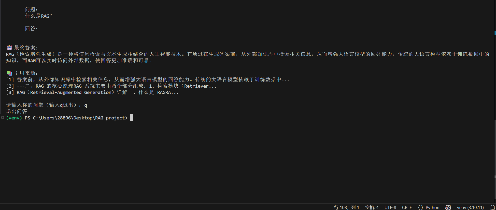
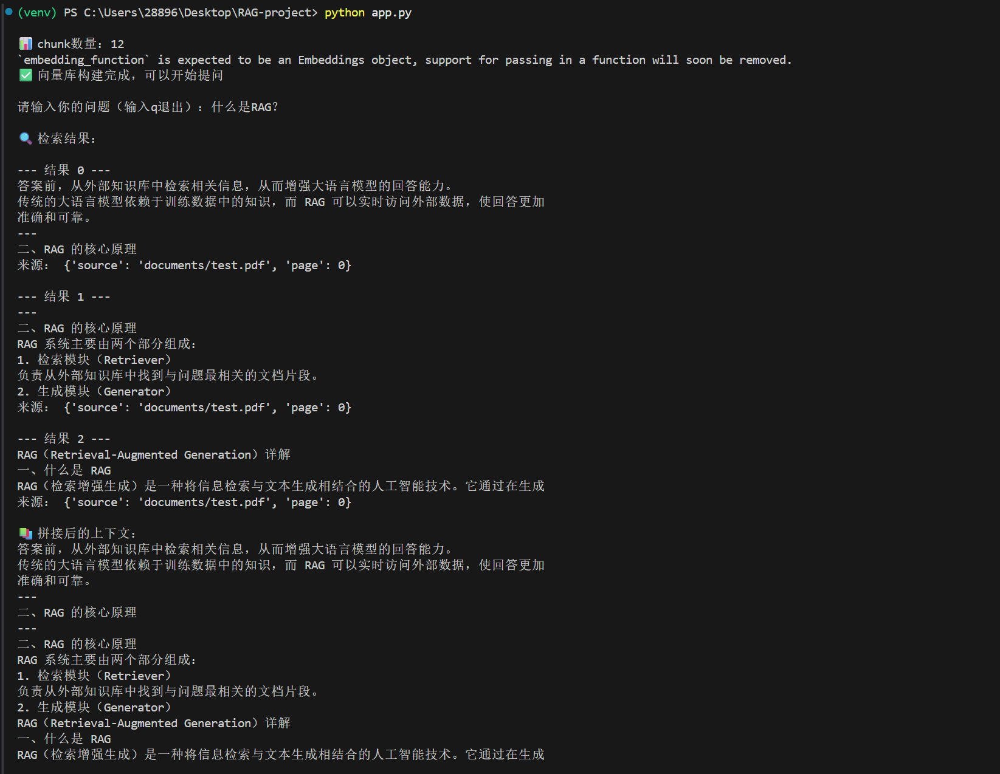

# RAG 知识库问答系统

## 一、项目简介

本项目实现了一个基于 RAG（Retrieval-Augmented Generation）的本地知识库问答系统。

系统支持对 PDF 文档进行解析、向量化存储，并结合大语言模型完成基于文档内容的问答。

项目目标是构建一个可解释、可扩展的企业知识库助手基础版本，用于理解 RAG 核心流程与工程实现。

---

## 二、项目特点

- RAG 架构：检索增强生成，提升回答准确性

- 多模型协同：智谱 Embedding + 豆包 LLM

- 多格式文档支持：当前支持 PDF，可扩展到多格式

- 引用来源输出：增强可解释性

---

## 三、效果演示

### 1️⃣ 问答效果截图
（终端输入问题 + 输出答案 + 引用来源）
示例位置：

---

### 2️⃣ 检索过程截图
（展示检索结果 Top-K + context 拼接）
示例位置：

---

## 四、核心流程（重点展开）

用户问题

  ↓

向量检索（FAISS）

  ↓

Top-K 文档片段

  ↓

上下文拼接（Context）

  ↓

LLM 生成答案（豆包）

  ↓

返回答案 + 引用来源

关键点说明：

- 检索阶段

  - 使用向量相似度匹配相关内容

  - 控制 Top-K 提高召回质量

- 上下文构建

  - 将多个文档片段拼接为 context

  - 限制长度避免噪声

- 生成阶段

  - 使用 Prompt 限制模型只基于文档回答

  - 减少幻觉

---

## 五、核心实现

### 1️⃣ 文档处理

- 文档加载（PDF）

- 文本切分（chunk）

- 控制 chunk size + overlap

---

### 2️⃣ 向量化（Embedding）

- 使用智谱 AI embedding

- 将文本转为向量

- 支持语义检索（而非关键词匹配）

---

### 3️⃣ 向量检索（FAISS）

- 本地向量库（轻量）

- 相似度搜索 Top-K

- 返回最相关文本片段

---

### 4️⃣ Prompt 设计

请严格基于文档内容回答问题，不要编造内容

优化点：

- 限制回答范围

- 提高答案可靠性

- 控制输出结构（分点）

---

### 5️⃣ LLM 生成

- 使用豆包模型

- 控制 temperature 提高稳定性

- 输出最终答案

---

### 6️⃣ 引用来源（加分项）

输出：

- 文档来源（source）

- 内容片段（preview）

---

## 六、技术栈

- LangChain：RAG流程搭建

- FAISS：向量数据库（本地检索）

- 智谱 Embedding（embedding-2）：文本向量化

- 豆包大模型（Doubao）：回答生成

- Python：核心开发语言

---

## 七、项目结构

rag-project/

├── app.py                          # 程序入口

├── pipelines/

│   └── rag_vector.py               # RAG 主流程

├── document_loader.py              # 文档加载与切分

├── embeddings/

│   └── embedding_model.py          # 向量模型（智谱）

├── vectorstore/

│   └── faiss_store.py              # 向量库构建

├── LLM/

│   └── doubao_LLM.py               # 大模型调用（豆包）

└── documents/

    └── test.pdf                   # 测试文档

---

## 八、当前不足

- 检索结果存在噪声（未做去重）

- chunk 切分较简单（未优化语义边界）

- Prompt 仍可进一步优化

- 无前端界面，仅支持命令行交互

---

## 九、可优化方向

- 检索优化（关键词过滤 / rerank）

- chunk 优化（重叠切分）

- 多轮对话（memory）

- 前端界面（Streamlit）

- 多文档知识库

- 引用来源高亮展示

---

## 十、总结

本项目实现了一个基础可用的 RAG 系统，验证了从文档处理到问答生成的完整流程，具备进一步扩展为企业知识库助手的能力。
